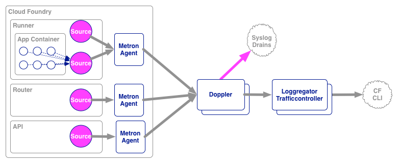
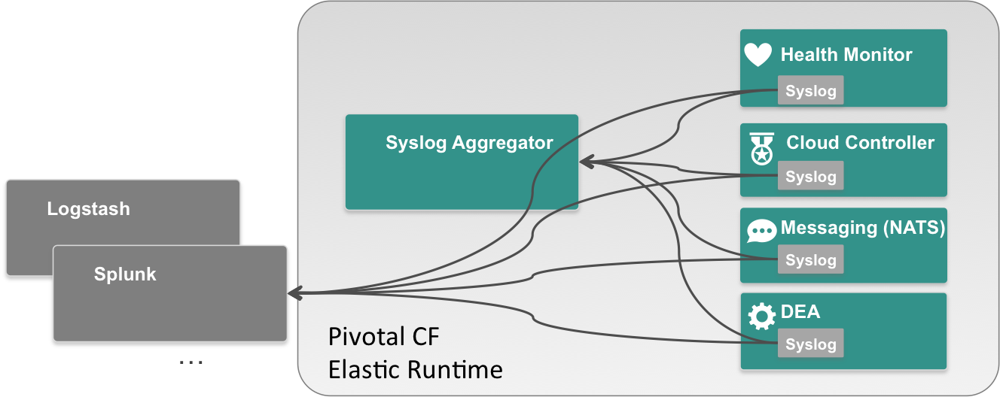
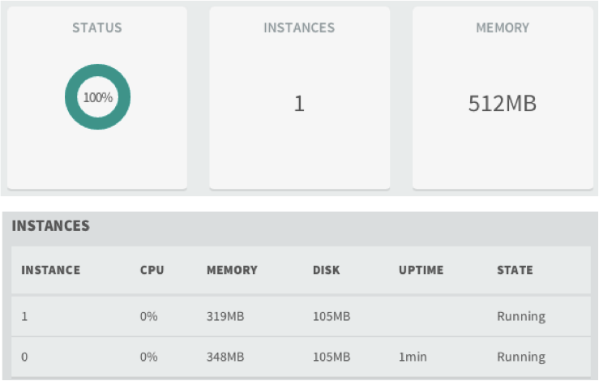
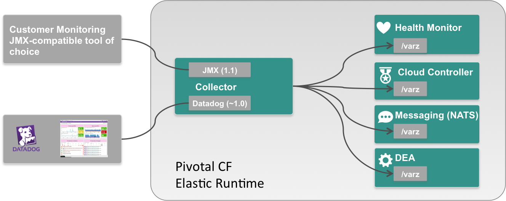

<!-- .slide: class="center" style="text-align: center" transitionSpeed="slow" data-background="#01786e" -->

## LOGGING & MONITORING

---

<!-- .slide: class="center" style="text-align: center" transitionSpeed="slow" data-background="#01786e" -->

# Application Logging

Note:
* Use CLI to tail application logs
* Drain application logs to 3rd party log service
Loggregator allows users to:
1. Tail their application logs.
2. Dump a recent set of application logs (where recent is a configurable number of log packets).
3. Continually drain their application logs to 3rd party log archive and analysis services.

---

## <!-- .element: class="fa-icon fa fa-lightbulb-o"-->Logging Constraints

- Loggregator collects STDOUT & STDERR from the customer's application. This may require configuration on the developer's side.
- A Loggregator outage does not affect the running application.
- Loggregator gathers and stores logs in a best-effort manner. While undesirable, losing the current buffer of application logs is acceptable.
- The 3rd party drain API mimics Heroku's in order to reduce integration effort for our partners. The Heroku drain API is simply remote syslog over TCP.

---

## <!-- .element: class="fa-icon fa fa-lightbulb-o"-->Logging Architecture

 * ___Sources___ - Logging agents that run on the Cloud Foundry components.
 * ___Metron___ - Metron agents are colocated with sources. They collect logs and forward them to:
 * ___Doppler___ - Responsible for gathering logs from the Metron agents, storing them in temporary buffers, and forwarding logs to 3rd party syslog drains.
 * ___Traffic Controller___ - Handles client requests for logs. Gathers and collates messages from all Doppler servers, and provides external API and message translation (as needed for legacy APIs).

Note:
In a redundant CloudFoundry setup, Loggregator can be configured to survive zone failures. Log messages from non-affected zones will still make it to the end user. PCF availability zones could be used as redundancy zones.

The role of Traffic Controller is to handle inbound web socket requests for log data. It does this by proxying the request to all loggregator servers (regardless of az). Since an application can be deployed to multiple azs, its logs can potentially end up on loggregator servers in multiple azs. This is why the traffic controller will attempt to connect to loggregator servers in each az and will collate the data into a single stream for the web socket client.

---

## <!-- .element: class="fa-icon fa fa-lightbulb-o"-->Logging Architecture Overview



---

## <!-- .element: class="fa-icon fa fa-keyboard-o"-->Tailing App Logs

To stream Loggregator app output to your terminal, use the command:

```
$ cf logs <app_name>

```

---

## <!-- .element: class="fa-icon fa fa-keyboard-o"-->Dumping App Logs

To view all the lines in the Loggregator buffer for an app, use the command:

```
$ cf logs <app_name> --recent

```

---

## <!-- .element: class="fa-icon fa fa-keyboard-o"-->Filtering Logs

To view some subset of log output, use `cf logs` in conjunction with filtering commands of your choice. In the example below, `grep -v` excludes all Router logs:

```
$ cf logs myapp --recent | grep -v RTR
    Connected, dumping recent logs for app myapp in org enterprise-org / space development as johndoe@example.com...
    2014-02-07T10:54:40.41-0800 [STG]     OUT -----> Uploading droplet (5.6M)
    2014-02-07T10:54:44.44-0800 [DEA]     OUT Starting app instance (index 0) with guid 4d397313-20e0-478a-9a74-307446eb7640
    2014-02-07T10:54:46.31-0800 [App/0]   OUT Express server started
    2014-02-07T10:57:53.60-0800 [API]     OUT Updated app with guid 4d397313-20e0-478a-9a74-307446eb7640 ({"instances"=>2})
    2014-02-07T10:57:53.64-0800 [DEA]     OUT Starting app instance (index 1) with guid 4d397313-20e0-478a-9a74-307446eb7640
    2014-02-07T10:57:55.88-0800 [App/1]   OUT Express server started
    ...
```

---

<!-- .slide: class="center" style="text-align: center" transitionSpeed="slow" data-background="#01786e" -->

# 3rd Party Log Draining

---

## <!-- .element: class="fa-icon fa fa-lightbulb-o"-->Steps For Setting Up Log Drain

* Configure the log management service to treat your application as a source of data
* Create a user-provided service instance with a syslog drain
* Bind the service instance to the application

```
cf cups syslog-drain -l syslog://logs.example.com:1234
cf bs myapp syslog-drain
cf restart
```

---

## <!-- .element: class="fa-icon fa fa-lightbulb-o"-->Elastic Runtime Component Logs



Note:
Cloud Foundry has the ability to capture logs from several components running on the elastic-runtime.
In order to aggregate these logs and export the data to an external log management and analysis system,
configure the syslog aggregator with your own syslog endpoint.
Once you provide a syslog endpoint, logs will be forwarded to that instead.

---

<!-- .slide: class="center" style="text-align: center;" transitionSpeed="slow" data-background="#01786e" -->

# Application Monitoring

---

## <!-- .element: class="fa-icon fa fa-lightbulb-o"-->Monitoring Using Web Console



---

## <!-- .element: class="fa-icon fa fa-lightbulb-o"-->Monitoring Using CF CLI

Show the running instances and health information for one or more applications.

```
$ cf app [app_name]

     state     since                    cpu    memory         disk
#0   running   2014-09-15 07:29:44 PM   0.0%   463.5M of 1G   115.6M of 1G
```

---

## <!-- .element: class="fa-icon fa fa-lightbulb-o"-->Monitoring Using Cloud Controller

Detailed output from the Cloud Controller can be retrieved:

```bash
$ cf curl /v2/apps/[app_id]

{  
   "0":{  
      "state":"RUNNING",
      "stats":{  
         "name":"sample-todo",
         "uris":[  
            "sample-todo.cfapps.io"
         ],
         "host":"10.10.17.37",
         "port":61006,
         "uptime":238033,
         "mem_quota":1073741824,
         "disk_quota":1073741824,
         "fds_quota":16384,
         "usage":{  
            "time":"2014-09-18 20:35:59 +0000",
            "cpu":0.0006248159407962876,
            "mem":486060032,
            "disk":121237504
         }
      }
   }
}
```
<!--.element: style="font-size:40%"-->

---

## <!-- .element: class="fa-icon fa fa-lightbulb-o"-->Application Monitoring Events from CF CLI

Application events can be displayed using the CF CLI:

```bash
$ cf events [app_name]

time                          event                 actor   description
2014-09-23T01:09:06.00-0600   audit.app.update      admin   state: STARTED
2014-09-23T01:07:53.00-0600   audit.app.update      admin
2014-09-23T01:07:53.00-0600   audit.app.map-route   admin
2014-09-23T01:07:53.00-0600   audit.app.create      admin   instances: 1, memory: 512, state: STOPPED, environment_json: PRIVATE DATA HIDDEN
```

---

## <!-- .element: class="fa-icon fa fa-lightbulb-o"-->Events Using Cloud Controller

Detailed app events can be retrieved from the Cloud Controller.

```
cf curl /v2/app_usage_events
{
   "total_results": 2,
   "total_pages": 1,
   "prev_url": null,
   "next_url": null,
   "resources": [
      {
         "metadata": {
            "guid": "0c87628f-5698-4f76-8f11-809637742bd4",
            "url": "/v2/app_usage_events/0c87628f-5698-4f76-8f11-809637742bd4",
            "created_at": "2014-09-23T07:08:02+00:00"
         },
         "entity": {
            "state": "STARTED",
            "memory_in_mb_per_instance": 512,
            "instance_count": 1,
            "app_guid": "aa68ffa4-bc96-45f3-93d5-d115188b8f82",
            "app_name": "spring-music",
            "space_guid": "82191461-ba63-42d1-8c12-a62d7f8bbe31",
            "space_name": "development",
            "org_guid": "6ce209eb-fa22-484f-94ad-5a19b527f856",
            "buildpack_guid": null,
            "buildpack_name": null
         }
      }
   ]
}
```
<!--.element: style="font-size:40%"-->

---

<!-- .slide: class="center" style="text-align: center;" transitionSpeed="slow" data-background="#01786e" -->

# Transaction Monitoring

Note:
**Challenge:** Application availability monitoring is not
sufficient.
* Applications can be available, but customer transactions fail.
* Businesses build on applications need to have deep visibility.
**Solution:** Application monitoring in the context of
transactions:
* Identify failing transactions.
* Identify the root cause of failing transactions.

---

## <!-- .element: class="fa-icon fa fa-lightbulb-o"-->App Monitoring Integration

* App Dynamics
* New Relic
* Spring Insight*

\*Configuration of Insight is not accomplished through the buildpack, but rather through the Insight dashboard.

Note: Configuration of Insight is not accomplished through the
buildpack, but rather through the Insight dashboard.  This service only works
for applications deploying into the Tomcat container and modifies the Tomcat
container with *TEMPORARY* support for behaviors needed by the Spring Insight
agent.

---

<!-- .slide: class="center" style="text-align: center;" transitionSpeed="slow" data-background="#01786e" -->

# Platform Monitoring

Note:
* Monitoring the platform logs
* Ops metrics provides live platform stats

---

## <!-- .element: class="fa-icon fa fa-lightbulb-o"-->Cloud Foundry Metric Collector

- Discovers the various components on the message bus and queries their /healthz and /varz interfaces.
- The metric data collected is published to collector plugins.
 - OpenTSDB, AWS CloudWatch and DataDog.
 - Plugins are extensible to publish data to other systems.

---

## <!-- .element: class="fa-icon fa fa-lightbulb-o"-->Pivotal Ops Metrics

* A JMX tool for elastic runtime
* Collects and exposes system data from Cloud Foundry components via a JMX endpoint
* Deployed as a tile
* Use any JMX client to pull the data from Ops Metrics endpoint

---

## <!-- .element: class="fa-icon fa fa-lightbulb-o"-->Pivotal Ops Metrics Data Flow



Note: The /varz http endpoint metrics data

---

## <!-- .element: class="fa-icon fa fa-question-circle"-->For More Information

 * http://docs.pivotal.io/pivotalcf/devguide/deploy-apps/streaming-logs.html
 * http://blog.pivotal.io/cloud-foundry-pivotal/products/monitoring-java-apps-appdynamics
 * http://blog.pivotal.io/cloud-foundry-pivotal/products/monitoring-cloud-foundry-applications-with-new-relic
